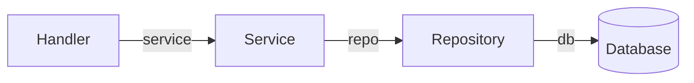

# Pepe Shop API

API для магазина атрибутики Pepe, сделанное на Go + Gin + GORM с PostgreSQL и фронтендом на Vue 3 + Vite.

## 📦 Структура проекта

```
apiservice/
├── cmd/
│   └── main.go          # точка входа сервера
├── internal/
│   ├── handler/         # HTTP слой (обработка запросов)
│   ├── service/         # бизнес-логика
│   ├── repository/      # доступ к данным (DB)
│   └── model/           # структуры данных
├── go.mod
└── go.sum
```

```
pepe/                   # фронтенд на Vue 3 + Vite
├── src/
├── public/
├── index.html
└── vite.config.ts
```

---

## 🚀 Архитектура backend

- **Handler → Service → Repository → DB**  
- Все слои связаны через указатели (`*`) для экономии памяти и возможности изменять объекты
- Handler отвечает только за HTTP (парсинг JSON, формирование ответов)
- Service содержит бизнес-логику
- Repository взаимодействует с базой данных (PostgreSQL)
- Model описывает структуры данных

### Пример цепочки зависимостей:



---

## ⚡ Пример эндпоинтов

| Method | Path            | Description              |
|--------|----------------|-------------------------|
| GET    | /api/products   | Получить все продукты   |
| POST   | /api/products   | Создать новый продукт   |
| POST   | /api/products/:id/upload | Загрузить картинку для продукта |

---

## 🛠 Технологии

- Backend: Go, Gin, GORM, PostgreSQL
- Frontend: Vue 3, Vite
- Формат API: JSON, единый формат:
```json
{
  "code": 200,
  "message": "ok",
  "data": [...]
}
```

---

## ⚡ Как запустить backend

1. Установить зависимости:

```bash
go mod tidy
```

2. Настроить PostgreSQL и переменную DSN в `main.go`:

```go
dsn := "host=localhost user=postgres password=postgres dbname=pepe port=5432 sslmode=disable"
```

3. Запустить сервер:

```bash
go run cmd/main.go
```

- Сервер будет доступен на `http://localhost:8080/api`
